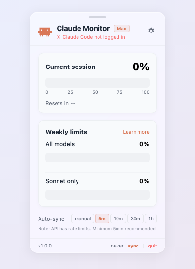
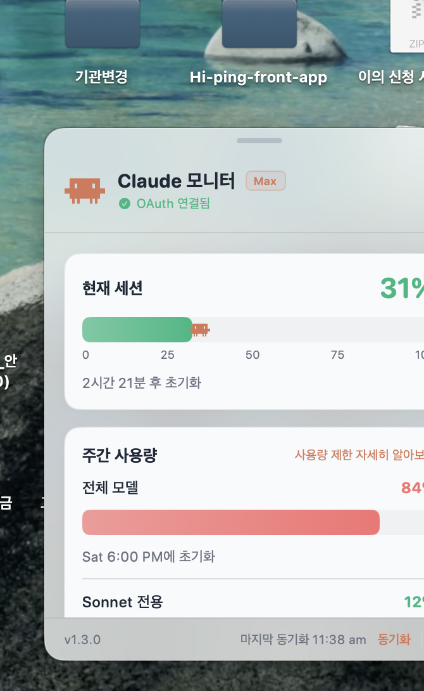

<p align="center">
  <svg viewBox="0 0 24 24" width="64" height="64" xmlns="http://www.w3.org/2000/svg">
    <path clip-rule="evenodd" d="M20.998 10.949H24v3.102h-3v3.028h-1.487V20H18v-2.921h-1.487V20H15v-2.921H9V20H7.488v-2.921H6V20H4.487v-2.921H3V14.05H0V10.95h3V5h17.998v5.949zM6 10.949h1.488V8.102H6v2.847zm10.51 0H18V8.102h-1.49v2.847z" fill="#D97757" fill-rule="evenodd"/>
  </svg>
</p>

<h1 align="center">Claude Usage Widget</h1>

<p align="center">
  <strong>Track your Claude Code usage in real-time</strong><br>
  Glassmorphism desktop widget for macOS & Windows
</p>

<p align="center">
  <a href="https://inno-hi.github.io/ClaudeUsageWidget/">Homepage</a> ·
  <a href="https://github.com/INNO-HI/ClaudeUsageWidget/releases">Downloads</a> ·
  <a href="https://velog.io/@khwee2000/Claude-Code-%EC%82%AC%EC%9A%A9%EB%9F%89-%ED%99%95%EC%9D%B8%ED%95%98%EB%8B%A4%EA%B0%80-%EA%B2%B0%EA%B5%AD-%EC%A7%81%EC%A0%91-%EC%9C%84%EC%A0%AF-%EB%A7%8C%EB%93%A4%EC%96%B4%EB%B2%84%EB%A0%B8%EB%8B%A4">Blog</a> ·
  <a href="https://github.com/INNO-HI/ClaudeUsageWidget/issues">Issues</a>
</p>

---

## Features

- **Real-time Monitoring** — 5-hour session usage & 7-day weekly limits
- **Auto-Update via Sparkle** — One-click "Check for Updates" inside the app (macOS, signed/notarized)
- **Launch at Login** — Optional auto-start when you log in to macOS
- **Mini / Full Mode** — Show or hide the menu-bar % text with one toggle
- **Usage Alerts** — Optional macOS notifications at 80% / 90% session usage
- **Universal Binary** — Native on Apple Silicon and Intel Macs
- **Rate-Limit Safe** — ±10% jitter between syncs and 2×→16× exponential backoff on 429
- **Glassmorphism UI** — Frosted glass design with smooth animations
- **Zero Token Cost** — Uses OAuth usage API only, no Claude messages sent
- **Auto Sync** — Configurable intervals: 5m / 10m / 30m / 1h / manual
- **Claude Code Buddy** — Official terminal pet system integrated (18 species, 5 rarity tiers, ASCII art)
- **Cross Platform** — Native Swift on macOS, Node.js web widget on Windows & Linux
- **Bilingual** — English / 한국어

---

## Screenshots

<table>
  <tr>
    <td align="center"><strong>Web Widget</strong></td>
    <td align="center"><strong>macOS Desktop Widget</strong></td>
  </tr>
  <tr>
    <td></td>
    <td></td>
  </tr>
</table>

---

## Claude Code Buddy

The widget integrates the official [Claude Code Buddy](https://docs.anthropic.com/en/docs/claude-code) terminal pet system.

```
  /buddy        → Hatch your buddy
  /buddy pet    → Pet your buddy (mood +1)
  /buddy off    → Put buddy to sleep
```

**18 species** — Each buddy is deterministically generated from your account ID. You can't choose or reroll.

```
  Cat         Dragon        Duck          Ghost         Owl
 /\_/\       /\_/\_          __          .___.        {o,o}
( · · )     (  · · )       >(··)__     | · · |      /)___)
 > ^ <       \ ~~ /         (  __)>    |  o  |       " "
             /|  |\          ||         \^^^/
```

**5 rarity tiers** — Common (60%) · Uncommon (25%) · Rare (10%) · Epic (4%) · Legendary (1%)

**5 stats** — DEBUGGING · PATIENCE · CHAOS · WISDOM · SNARK

**1% Shiny** variant with sparkle effects

---

## Installation

### macOS (Native App)

> Requires macOS 13.0+ · Apple Silicon & Intel (Universal Binary)

**Download** the latest signed & notarized DMG from [Releases](https://github.com/INNO-HI/ClaudeUsageWidget/releases), drag the app to `/Applications`, and launch.

> ✅ Signed with `Developer ID Application: INNO-HI Inc.` and notarized by Apple.
> Future updates ship via in-app **Settings → Check for Updates** (Sparkle).

Or build from source (requires an Apple Developer account for full signing):

```bash
git clone https://github.com/INNO-HI/ClaudeUsageWidget.git
cd ClaudeUsageWidget
bash build.sh
open "build/Claude Usage Widget.app"
```

### Windows / Linux (Cross-platform)

> Requires Node.js 18+

```bash
git clone https://github.com/INNO-HI/ClaudeUsageWidget.git
cd ClaudeUsageWidget
node src/server.js
```

Opens automatically at `http://127.0.0.1:19522`.

---

## Prerequisites

1. Install [Claude Code](https://docs.anthropic.com/en/docs/claude-code)
2. Run `claude login` in your terminal
3. Launch the widget

Credentials are read from `~/.claude/.credentials.json` (or macOS Keychain).

---

## How It Works

```
┌─────────────┐     OAuth Token     ┌──────────────────────┐
│  Widget App  │ ──────────────────► │  Anthropic Usage API │
│  (local)     │ ◄────────────────── │  /api/oauth/usage    │
└─────────────┘    Usage Data (%)    └──────────────────────┘

• Reads OAuth credentials from ~/.claude/.credentials.json
• Calls GET https://api.anthropic.com/api/oauth/usage
• Auto-refreshes expired tokens
• No messages sent to Claude = zero token cost
```

---

## Configuration

All settings live behind the gear icon in the popover.

| Setting | Options | Default |
|---------|---------|---------|
| Auto-sync | manual / 5m / 10m / 30m / 1h | 5m |
| Language | English / 한국어 | English |
| Launch at Login | on / off | off |
| Show menu-bar % (mini/full mode) | on / off | on |
| Usage Alerts (80% / 90%) | on / off | off |
| Check for Updates | one-click | — |
| Buddy | /buddy · /buddy pet · /buddy off | off |

---

## Troubleshooting

### "Claude Monitor is damaged and can't be opened"
This was caused by older unsigned builds. The current release is **signed (Developer ID) and notarized**, so you should not see this message. If you downloaded an older build, run:

```bash
xattr -cr "/Applications/Claude Usage Widget.app"
```

### Widget shows `--` or `Token expired`
Your Claude Code OAuth token has expired. Run in Terminal:

```bash
claude login
```

Then click **Refresh** in the widget settings.

### Launch at Login isn't sticking
macOS may have queued a permission prompt under **System Settings → General → Login Items**. Enable the entry there, or toggle the option off/on inside the widget.

### No notifications appearing
First time you enable **Usage Alerts**, macOS asks for notification permission. If you missed it: **System Settings → Notifications → Claude Usage Widget → Allow Notifications**.

### "Check for Updates" says nothing happens
You're already on the latest version. Sparkle silently confirms when you're up to date.

---

## Change Log

See [CHANGELOG.md](CHANGELOG.md) for the full version history.

### v1.1.0 (latest)
- Added **Sparkle auto-update** (signed via EdDSA)
- Added **Launch at Login** option
- Added **Mini / Full mode** toggle (hide menu-bar %)
- Added **Usage Alerts** (80% / 90% session thresholds)
- Added **Universal Binary** (Intel + Apple Silicon)
- Added **API rate-limit safety** — ±10% jitter and 2×→16× exponential backoff on 429
- Build pipeline now produces signed & notarized DMG

### v1.0.0
- Initial public release with menu-bar widget, glassmorphism UI, OAuth-based usage monitoring

---

## Tech Stack

| Platform | Stack |
|----------|-------|
| macOS (native) | Swift, SwiftUI, AppKit, ServiceManagement, UserNotifications, Security (Keychain), [Sparkle 2.x](https://sparkle-project.org/) |
| Cross-platform | Node.js, HTML/CSS/JS |

---

## License

MIT

---

<p align="center">
  Built with ♥ for Claude Code users
</p>
